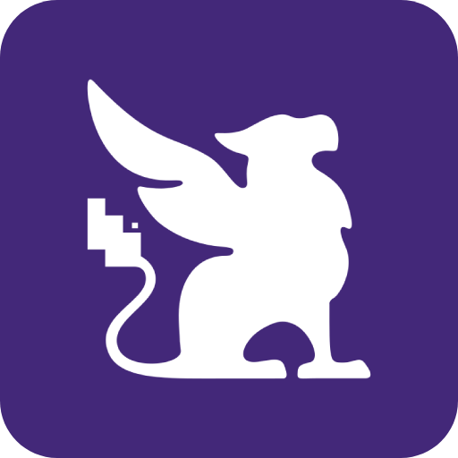

<div align="center">
  
  <h1>Habitica Sync</h1>
  <p>
    <strong>Turn your Commits into Gold and XP.</strong><br>
    Gamify your open-source work and professional development by connecting GitHub to Habitica.
  </p>

  <p>
    <a href="https://github.com/drazenbebic/habitica/actions"></a>
    <a href="https://opensource.org/licenses/MIT"></a>
    <a href="https://twitter.com/drazenbebic"></a>
  </p>
</div>

---

## About

**Habitica Sync** acts as a bridge between your GitHub workflow and your Habitica RPG character. Instead of manually checking off "Did code today" tasks, this application listens to GitHub webhooks and automatically rewards you based on the complexity and impact of your work.

It is built with **Next.js**, **Prisma**, and **PostgreSQL**.

## Features

- **Automated Rewards**:
    - **Push Commits**: Earn XP for every commit (with anti-spam caps).
    - **Pull Requests**: Get a large XP boost for opening and merging PRs.
    - **Code Reviews**: Incentivize team collaboration by rewarding code reviews.
- **Secure**: Uses GitHub Apps and Webhook signatures verification.
- **Configurable**: Define your own difficulty multipliers (e.g., "Hard Mode" for legacy repos).
- **Open Source**: Host it yourself or use the hosted version.

## Tech Stack

- **Framework**: [Next.js 16](https://nextjs.org/) (App Router)
- **Database**: PostgreSQL
- **ORM**: [Prisma](https://www.prisma.io/)
- **Styling**: Tailwind CSS
- **Authentication**: NextAuth.js / GitHub OAuth
- **Deployment**: Vercel

## Getting Started

### Prerequisites

- Node.js 22+
- PostgreSQL Database (Local or Cloud)
- A GitHub App (for Webhooks)

### 1. Clone the repository

```bash
git clone https://github.com/drazenbebic/habitica.git
cd habitica
```

### 2. Configure environment

```bash
cp .env.example .env
```

> Tip: Generate secrets with `openssl rand -base64 32`

### 3. Database Setup

You can run a local PostgreSQL database using docker and the available `docker-compose.yml`

```bash
docker compose up -d
```

### 4. Install dependencies

```bash
yarn install
```

### 5. Run the Server

```bash
yarn run dev
```

Visit http://localhost:3000 to see the app.

## Contributing

We welcome contributions! Please see our [Roadmap](https://habitica.bebic.dev/roadmap) to see what we are working on.

1. Fork the repository.
2. Create a feature branch (`git checkout -b feat/amazing-feature`).
3. Commit your changes (`git commit -m 'feat: add amazing feature'`).
4. Push to the branch (`git push origin feat/amazing-feature`).
5. Open a Pull Request.

Please ensure you use the provided Pull Request Template.

## License

Distributed under the MIT License.

## Author

Drazen Bebic

- Website: [www.bebic.dev](https://www.bebic.dev)
- GitHub: [@drazenbebic](https://github.com/drazenbebic/)